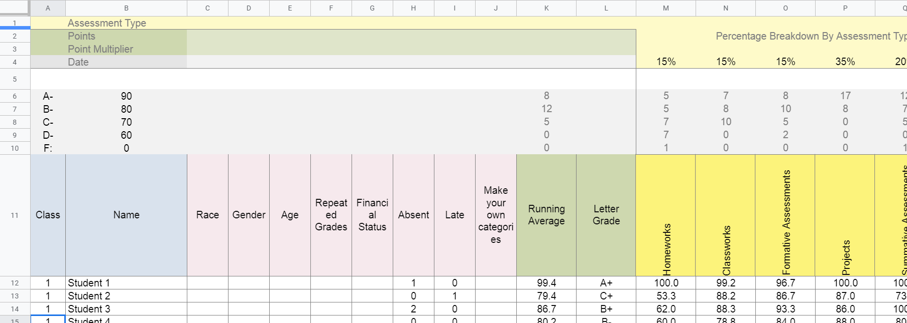

```{r setup, include = FALSE}
# This is the recommended set up for flipbooks
# you might think about setting cache to TRUE as you gain practice --- building flipbooks from scratch can be time consuming
knitr::opts_chunk$set(fig.width = 6, message = FALSE, warning = FALSE, comment = "", cache = F)
```


```{r presentation-libraries, include=FALSE}
library(flipbookr)
library(knitr) #not part of walkthrough
```


## 8.1 Topics Emphasized

-   Tidying data

-   Transforming data

-   Visualizing data

-   Modeling data

---

## 8.2 Functions Introduced

-   `janitor::remove_empty()`

-   `stringr::contains()`

-   `cor()`

---

## 8.3 Vocabulary

-   correlation

-   directory

-   environment

-   linear model

-   linearity

-   missing values/ NA

-   outliers

-   string

---

## 8.4 Chapter Overview

This walkthrough explores the ubiquitous but not-often-analyzed classroom gradebook dataset. We will use data science tools and techniques and focus more on analyses, including correlations and linear models.

--

### 8.4.1 Background

This walkthrough goes through a series of analyses using the data science framework. The first analysis centers around a common K-12 classroom tool: the gradebook. While gradebook data is common in education, it is sometimes ignored in favor of data collected by evaluators and researchers or data from state-wide tests. Nevertheless, it represents an important, untapped data source, and one for which a data science approach can reveal the potential of analyzing a range of education data sources.

---

### 8.4.2 Data Sources

This walkthrough uses a simulated dataset. We can [download the excel file from GitHub](https://github.com/data-edu/data-science-in-education/blob/master/data/gradebooks/ExcelGradeBook.xlsx) to our computer by clicking on the 'Download' button.

--

### 8.4.3 Methods

This analysis uses a linear model, which relates one or more X, or independent variables, to a Y, or dependent variable, and a correlation analysis.

---

## 8.5 Load Packages

Begin by loading the libraries that will be used:

```{r walkthrough-libraries, message=FALSE, warning=FALSE}
# Install packages only once
#install.packages("tidyverse")
#install.packages("here")
#install.packages("readxl")
#install.packages("janitor")
#install.packages("remotes")
#remotes::install_github("data-edu/dataedu")

# Load libraries
library(tidyverse)
library(here)
library(readxl) #to read and import Excel spreadsheets
library(janitor) #provides a number of functions related 
                  #to cleaning and preparing data
library(dataedu)
```

---

## 8.6 Import Data

After [downloading the excel file from GitHub](https://github.com/data-edu/data-science-in-education/blob/master/data/gradebooks/ExcelGradeBook.xlsx), here's a snippet of the file: 



---

### 8.6.1 Import Using a File Path

The function `getwd()` will help locate the current working directory. This tells where on the computer R is currently working with files.

```{r getwd}
# See the current working directory
getwd()
```

---

The following code runs the function `read_excel()` which reads and saves the data from `ExcelGradeBook.xlsx` to an object also called `ExcelGradeBook`. Note the two arguments specified in this code: `sheet = 1` and `skip = 10`. This Excel file is similar to one you might encounter in real life with superfluous features that we are not interested in. This file has 5 different sheets and the first 10 rows contain things we won't need. Thus, `sheet = 1` tells `read_excel()` to just read the first sheet in the file and disregard the rest. Then, `skip = 10` tells `read_excel()` to skip reading the first 10 rows of the sheet and start reading from row 11, which is where the column headers and data actually start inside the Excel file.

```{r import-path}
ExcelGradeBook <- read_excel("C:/Users/laptop/Downloads/ExcelGradeBook.xlsx", 
                             sheet = 1, skip = 10)
```

--

Note that the above path is unique to my machine and will not work for you. Please adjust the path to match the specifics of your file location.

--

You may have noticed that the path I used above does not match my working directory. When I downloaded the file, it automatically went to my Downloads folder which is not in my working directory. One benefit of using the path file is that the file does not need to be located in my working directory to be imported. However, there is a big con to this that I will explain next.

---

### 8.6.2 Import Using `here()`

Alternatively, we can read in the file using `here()`. This uses your root directory, so you will need to make sure the file is located there. So I made a copy of the file from my downloads from the previous example (if I move it, the previous example won't work) to my root directory `r here()`. The reason to do this method over the path method above is that it makes our code reproducible when we share with others or even when we, individually, use a different computer! Instead of needing to edit the code itself, everything will run (without edits) as long as all of the files are located in the current root directory! Very cool! 

*For more information on the `here package` and project-oriented workflow, see [this article by Jenny Bryan](https://www.tidyverse.org/blog/2017/12/workflow-vs-script/)*

--

```{r import-here}
# Use readxl package to read and import file and assign it a name
ExcelGradeBook <-
  read_excel(
    here("R", "2021-03-17", "ExcelGradeBook.xlsx"),
    sheet = 1,
    skip = 10
  )
```

`ExcelGradeBook.xlsx` is located in the folder `2021-03-17` in the folder `R` which is in my root directory.

---

The `ExcelGradeBook` file is now imported into RStudio. Next, we'll assign the data frame to a new name using the code below. Renaming cumbersome filenames can improve the readability of the code and make it easier for the user to call on the dataset later on in the code.

```{r rename}
# Rename data frame
gradebook <- ExcelGradeBook
```

--

The environment now has two versions of the dataset. There is `ExcelGradeBook`, which is the original dataset we've imported. There is also `gradebook`, which is a copy of `ExcelGradeBook`. We will make our edits to the `gradebook` version. If we make a mistake and mess up the `gradebook` data frame and are not able to fix it, we can reset the data frame to return to the same state as the original `ExcelGradeBook` data frame by running `gradebook <- ExcelGradeBook` again. This will overwrite any errors in the `gradebook` data frame with the originally imported `ExcelGradeBook` data frame.

---

## 8.7 Process Data

### 8.7.1 Tidy Data

Let's take a look at the first five observations our data frame:

---

```{r}
kable(gradebook[1:5, ])
```

---

Yikes. We have rows and columns we don't need and column names that have spaces between words. The data is **not** tidy. All these things make the data tough to work with.

--

We COULD begin to overcome these challenges before importing the file into RStudio by deleting the unnecessary parts of the Excel file then saving it as a `.csv` file. However, if we clean the file outside of R, this means if we ever have to clean it up again (say, if the dataset is accidentally deleted and we need to re-download it from the original source) we would have to do everything from the beginning, and may not recall exactly what we did in Excel prior to importing the data to R.

It is recommended to clean the original data in R so that we can recreate all the steps necessary for analysis.

---

### 8.7.2 About {janitor}

{janitor} has many handy functions to clean and tabulate data. Some examples include:

-   `clean_names()`, which takes messy column names that have periods, capitalized letters, spaces, etc. into R-friendly column names

-   `get_dupes()`, which identifies and examines duplicate records

-   `tabyl()`, which tabulates data in a `data.frame` format, and can be 'adorned' with the `adorn_` functions to add total rows, percentages, and other dressings

---

Let's look at our column names:

```{r}
# look at original column names
colnames(gradebook)
```

---

That output is long too long for our slide.

--

We can just look at the first ten by using `head()`:

```{r}
# look at original column names
head(colnames(gradebook)) 
```

--

That's better.

--

Now let's clean the names and compare:

```{r}
gradebook <- 
  gradebook %>% 
  clean_names() 

# look at cleaned column names
head(colnames(gradebook))
```

---

Review the first five observations of the `gradebook` data frame now:

```{r}
kable(gradebook[1:5, ])
```

--

The data frame looks a bit cleaner but there are still some things we can remove.

--

We can remove the columns, rows, or both that have no information in them with `remove_empty()`:

---

`r chunk_reveal("remove-empty")`

```{r remove-empty, include=FALSE}
# Removing rows with nothing but missing data
  gradebook %>% 
  remove_empty("cols") %>%
  remove_empty("rows") ->
  gradebook
```

---

And review the first five observations of our data frame again:

```{r}
kable(gradebook[1:5, ])
```

---

Now that the empty rows and columns have been removed, we notice there are two columns, `absent` and `late`, where it seems someone started putting data into but then decided to stop:

```{r}
gradebook %>% 
  select(absent, late)
```

--

These two columns didn't get removed by the last chunk of code because they technically contained some data in those columns. Since the simulated enterer of this simulated class data decided to abandon using the `absent` and `late` columns in this gradebook, we can remove it from our data frame as well.

---

Let's use the `select()` function, which tells R what columns we want to keep. We'll use negative signs to say we want the dataset without `absent` and `late`:

---

`r chunk_reveal("neg-select", break_type = "auto")`

```{r neg-select, include=FALSE}
# Remove a targeted column because we don't use absent and late at this school.
gradebook %>% 
  select(-absent, -late) ->
  gradebook
```

---

Inspect the first five observations of the data frame once more to see the difference:

```{r}
kable(gradebook[1:5, ])
```

---

### 8.7.3 Create New Variables and Further Process the Data

The following code chunk first creates a new data frame named `classwork_df`, then selects particular variables from the gradebook dataset using `select()`, and finally 'gathers' all the homework data into new columns.

We can use functions from the package {stringr} within `select()`. Here, we'll use the function `contains()` from {stringr} to tell R to select columns that contain a certain string (that is, text). The function searches for any column with the string `classwork_`. The underscore makes sure the variables from `classwork_1` all the way to `classwork_17` are included in `classwork_df`.

`pivot_longer()` transforms the dataset into tidy data, where each variable forms a column, each observation forms a row, and each type of observational unit forms a table.

Note that `scores` are in character format. We use `mutate()` to transform them to numeric.

---

`r chunk_reveal("classwork-df")`

```{r classwork-df}
# Creates new data frame, 
# selects desired variables 
# from gradebook, and gathers 
# all classwork scores into 
# key/value pairs
gradebook %>%
  select(
    name,
    running_average,
    letter_grade,
    homeworks,
    classworks,
    formative_assessments,
    projects,
    summative_assessments,
    contains("classwork_")) %>%
  mutate_at(vars(contains("classwork_")), 
            list(~ as.numeric(.))) %>%
  pivot_longer(
    cols = contains("classwork_"),
    names_to = "classwork_number",
    values_to = "score"
  ) -> classwork_df
```

---

View the first few observations of the new data frame and notice which columns were selected for this new data frame. Also, note how all the classwork scores were gathered under new columns `classwork_number` and `score`. We will use this `classwork_df` data frame later:

```{r}
kable(classwork_df[1:7, ])
```

---

## 8.8 Analysis

### 8.8.1 Visualize Data

Visual representations of data are more human friendly than just looking at numbers alone. This next line of code shows a summary of the data by each column:

---

```{r}
# Summary of the data by columns
summary(gradebook)
```

---

But let's do more than just print numbers to a screen. We'll use the {ggplot2} package from within {tidyverse} to graph some of the data to help get a better grasp of what the data looks like. This code uses {ggplot2} to graph categorical variables into a bar graph. Here we can see the variable `letter_grade` is plotted on the x-axis showing the counts of each letter grade on the y-axis:

---


`r chunk_reveal("bargraph", chunk_options = "fig.width = 12", break_type = "auto")`

```{r bargraph, include=FALSE}
# Bar graph for categorical variable
gradebook %>%
  ggplot(aes(x = letter_grade,
             fill = running_average > 90)) +
  geom_bar() +
  labs(title = "Bar Graph of Student Grades",
       x = "Letter Grades",
       y = "Count",
       fill = "A or Better") +
  scale_fill_dataedu() +
  theme_dataedu()
```

---

Using {ggplot2}, we can create many types of graphs. Using our `classwork_df` from earlier, we can see the distribution of scores and how they differ from classwork to classwork using boxplots. We are able to do this because we have made the `classworks` and `scores` columns into tidy formats:

---

`r chunk_reveal("score-boxplot", chunk_options = "fig.width = 12", break_type = "auto")`

```{r score-boxplot, include=FALSE}
# Boxplot of scores per classwork
classwork_df %>%
  ggplot(aes(x = classwork_number,
             y = score,
             fill = classwork_number)) +
  geom_boxplot() +
  labs(title = "Distribution of Classwork Scores",
       x = "Classwork",
       y = "Scores") +
  scale_fill_dataedu() +
  theme_dataedu() +
  theme(
    # removes legend
    legend.position = "none",
    # angles the x axis labels
    axis.text.x = element_text(
      angle = 45, hjust = 1)
    )
```

---

### 8.8.2 Model Data

**Deciding on an Analysis**

Using this spreadsheet, we can start to form hypotheses about the data. For example, we can ask ourselves, "Can we predict overall grade using formative assessment scores?" For this, we will try to predict a response variable Y (overall grade) as a function of a predictor variable X (formative assessment scores). The goal is to create a mathematical equation for overall grade as a function of formative assessment scores when only formative assessment scores are known.

--

**Visualize Data to Check Assumptions**

It's important to visualize data to see any distributions, trends, or patterns before building a model. We use {ggplot2} to understand these variables graphically.

--

**Linearity**

First, we plot X and Y to determine if we can see a linear relationship between the predictor and response. The x-axis shows the formative assessment scores while the y-axis shows the overall grades. The graph suggests a correlation between overall class grade and formative assessment scores. As the formative scores goes up, the overall grade goes up too.

---

`r chunk_reveal("scatterplot", break_type = "auto")`

```{r scatterplot, include=FALSE}
# Scatterplot between formative 
# assessment and grades by percent
# To determine linear relationship
gradebook %>%
  ggplot(aes(
    x = formative_assessments,
    y = running_average)) +
  geom_point(
    color = dataedu_colors(
      "green")) +
  labs(
    title = "Relationship Between Overall Grade and Formative Assessments",
    x = "Formative Assessment Score",
    y = "Overall Grade in Percentage") +
  theme_dataedu()
```

---

We can layer different types of plots on top of each other in {ggplot2}. Here the scatterplot is layered with a line of best fit, suggesting a positive linear relationship:

---

`r chunk_reveal("linear", break_type = "auto")`

```{r linear, include=FALSE}
# Scatterplot between formative 
# assessment and grades by percent
# To determine linear relationship
# With line of best fit
gradebook %>%
  ggplot(aes(
    x = formative_assessments,
    y = running_average)) +
  geom_point(
    color = dataedu_colors("green")) +
  geom_smooth(
    method = "lm",
    se = TRUE) +
  labs(title = "Relationship Between Overall Grade and Formative Assessments",
       x = "Formative Assessment Score",
       y = "Overall Grade in Percentage") +
  theme_dataedu()
```

---

**Outliers**

Now we use boxplots to determine if there are any outliers in formative assessment scores or overall grades. As we would like to conduct a linear regression, we're hoping to see no outliers in the data:

---

`r chunk_reveal("formative-boxplot", break_type = "auto")`

```{r formative-boxplot, include=FALSE}
# Boxplot of formative assessment scores
# To determine if there are any outliers
gradebook %>%
  ggplot(aes(x = "",
             y = formative_assessments)) +
  geom_boxplot(fill = dataedu_colors("yellow")) +
  labs(title = "Distribution of Formative Assessment Scores",
       x = "Formative Assessment",
       y = "Score") +
  theme_dataedu()
```

---

`r chunk_reveal("grade-boxplot", break_type = "auto")`

```{r grade-boxplot, include=FALSE}
# Boxplot of overall grade scores in percentage
# To determine if there are any outliers
gradebook %>%
  ggplot(aes(x = "",
             y = running_average)) +
  geom_boxplot(fill = dataedu_colors("yellow")) +
  labs(title = "Distribution of Overall Grade Scores",
       x = "Overall Grade",
       y = "Score in Percentage") +
  theme_dataedu()
```

---

We don't see any for these two variables, so we can proceed with the model.

---

### 8.8.3 Correlation Analysis

We want to know the strength of the relationship between the two variables, formative assessment scores and overall grade percentage. The strength is denoted by the "correlation coefficient." The correlation coefficient goes from -1 to 1. If one variable consistently increases with the increasing value of the other, then they have a positive correlation (towards 1). If one variable consistently decreases with the increasing value of the other, then they have a negative correlation (towards -1). If the correlation coefficient is 0, then there is no relationship between the two variables.

--

```{r}
cor(gradebook$formative_assessments, gradebook$running_average)
```

--

Correlation is good for finding relationships but it does *not* imply that one variable causes the other (correlation does not mean causation).

---

## 8.9 Results

Now that we've checked our assumptions and seen a linear relationship, we can build a linear model - a mathematical formula that calculates your running average as a function of our formative assessment score. This is done using the `lm()` function, where the arguments are:

-   Our predictor (`formative_assessments`)

-   Our response (`running_average`)

-   The data (`gradebook`)

`lm()` is available in "base R" - that is, no additional packages beyond what is loaded with R automatically are necessary.

---

```{r}
linear_mod <- 
  lm(running_average ~ formative_assessments, data = gradebook)

summary(linear_mod)
```

---

When we fit a model to two variables, we create an equation that describes the relationship between those two variables based on their averages. This equation uses the `(Intercept)`, which is 50.11511, and the coefficient for `formative_assessments`, which is .42136. The equation reads like this:

```{}
running_average = 50.11511 + 0.42136*formative_assessments
```

--

We interpret these results by saying "For every one unit increase in formative assessment scores, we can expect a .421 unit increase in running average scores." This equation estimates the relationship between formative assessment scores and running average scores in the student population.

---

**More on Interpreting Models**

If you were describing the formative assessment system to stakeholders, you might say something like, "We can generally expect our students to show a .421 increase in their running average score for every one point increase in their formative assessment scores." That makes sense, because your goal is to explain what happens **in general**.

--

But we can rarely expect every prediction about individual students to be correct, even with a reliable model. So when using this equation to inform how you support an individual student, it's important to consider all the real-life factors, visible and invisible, that influence an individual student outcome creating residuals. Residuals are the differences between predicted values and actual values that aren't explained by your linear model equation.

---

## 8.10 Conclusion

We first *imported* our data, then *cleaned and transformed* it. Once we had the data in a tidy format, we were able to *explore* the data using data visualization before *modeling* the data using linear regression.

--

If we ran this analysis for someone else: a teacher or an administrator in a school, we might be interested in sharing the results in the form of a report or document. Thus, the only remaining step in this analysis would be to communicate our findings.

--

I recommend using a tool such as [RMarkdown](https://rmarkdown.rstudio.com/). It provides the functionality to easily generate reports that include both text (like the words you just read) as well as code and the output from code that are displayed together in a single document (PDF, Word, HTML, and other formats).

---
class: middle, center, inverse

# The End!

The flipbooked portion of this presentation was created with the new {flipbookr} package.  

Get it with remotes::install_github("EvaMaeRey/flipbookr")
