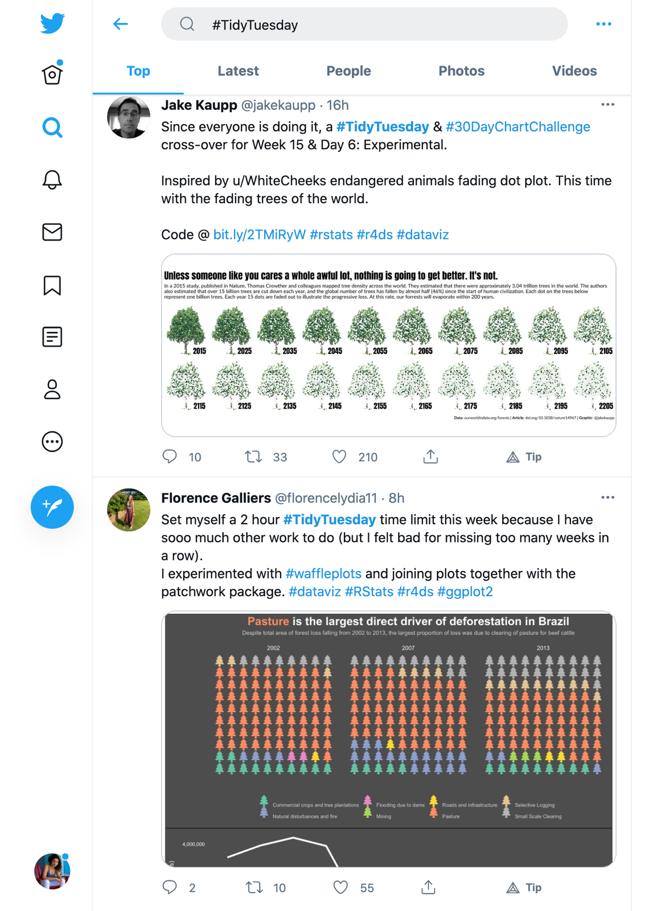
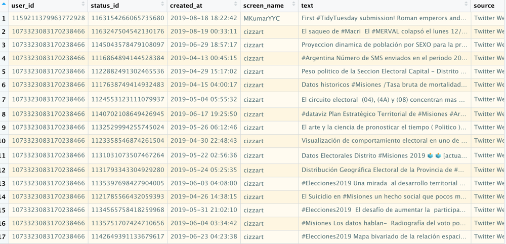
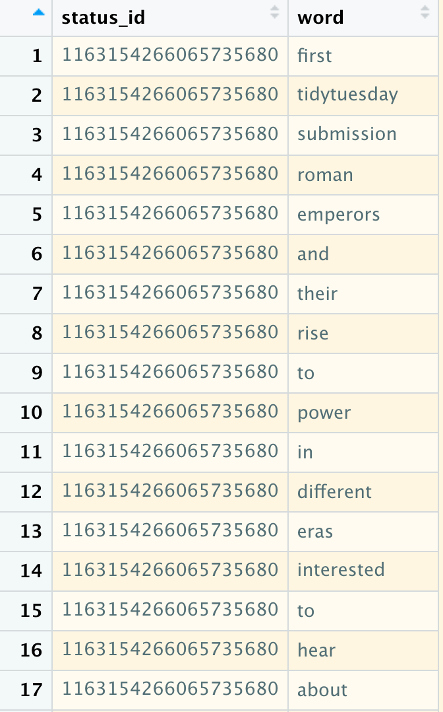
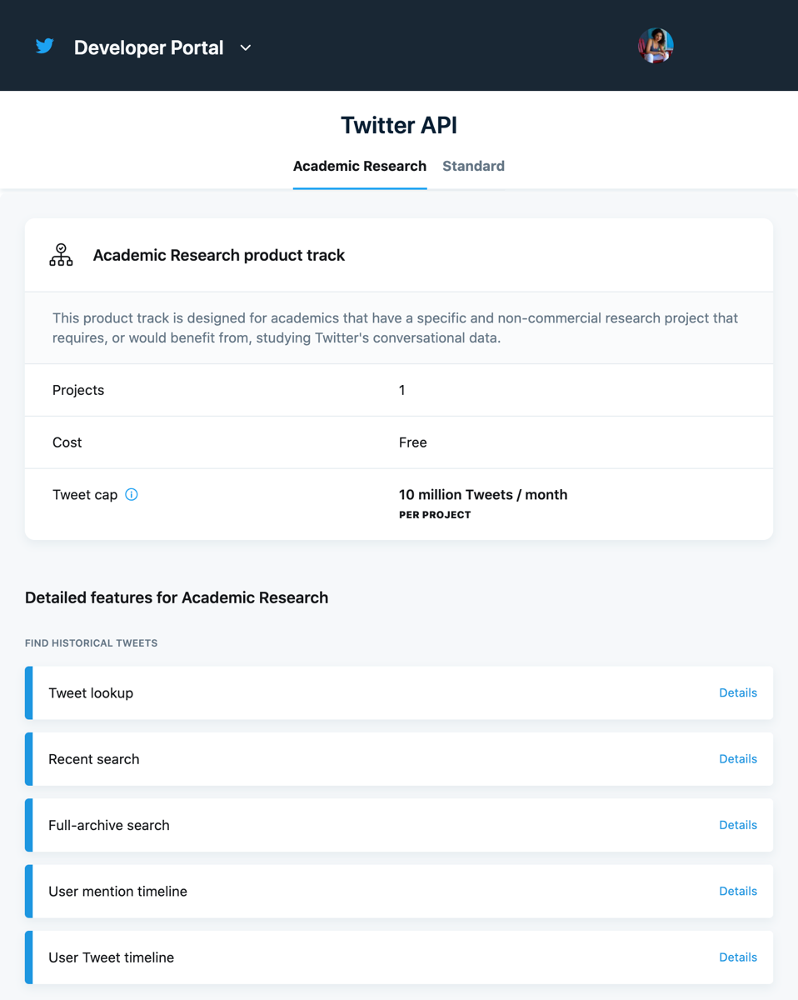

# Learning Objectives


+ Understand how to retrieve data from Twitter
+ Understand the robustness of Twitter data
+ Learn basic principles of **N**atural **L**anguage **P**rocessing (NLP)
+ Learn how to apply those principles to process social media data
+ Learn how to use the `tidytext` package to analyze social media data
+ Understand what a *sentiment analysis* is
+ Learn how to perform a *sentiment analysis* on Twitter data


---

class: center, inverse
background-image: url("img/dsieur_pkgs.png")
background-size: contain

# Packages


---

# What is text analysis?
</br>

> "the process of automatically classifying and extracting meaningful information from unstructured text. It involves detecting and interpreting trends and patterns to obtain relevant insights from data" *

## Use Cases

+ count the number of key words that appear in survey responses
+ analyze word patterns in message board posts
+ analyze the public opinion on certain topics 

.footnote[
*Someone on Google]


---

# Our Data
.pull-left[
## Source: Twitter

## Strata: #TidyTuesday
 - \# <- hashtag
   - i.e. #rstats

]
.pull-right[


]

---

# Importing & Viewing Data

## From the `dataedu` package

```{r, warning=FALSE}
raw_tweets <- dataedu::tt_tweets
```
```{r, eval=FALSE}
glimpse(raw_tweets)
```

## From `rtweet`

```{r, eval=FALSE}
library(rtweet)

#limited to the last 7 days on the free tier
tt <- search_tweets("#TidyTuesday", n = 10000, include_rts = FALSE)

```

[Learn more about the rtweet package!](https://github.com/ropensci/rtweet)

---

# Process our Data

.pull-left[


Right now, our data is 4,418 x 90!
]
.pull-right[
## Goal: to have each row be a word
## Important Vars: `status_id`, `text`

```{r}
library(tidyverse)
tweets <-
  raw_tweets %>%
  # filter for English tweets
  filter(lang == "en") %>%
  select(status_id, text) %>%
  # Convert the ID field to the character
  mutate(status_id = as.character(status_id))
```
]
---
# Prepring data for counting (pt.1)

## How can we count words when our tweet is string of text? 

### We *tokenize* it!


> A token is a meaningful unit of text, such as a word, that we are interested in using for analysis, and tokenization is the process of splitting text into tokens. This one-token-per-row structure is in contrast to the ways text is often stored in current analyses, perhaps as strings or in a document-term matrix.

</br>
To do this we use the `tidytext::unnest_tokens()` function.
```{r}
library(tidytext)
tokens <- 
  tweets %>%
  unnest_tokens(output = word, input = text)

```

```{r}
dim(tokens)
#> [1] 131233      2
```

---
# Prepring data for counting (pt.2)

.pull-left[

]

.pull-right[
There are a lot of unnecessary words included, like "a" or "the". These are called *stop words*.  

Thankfully, we can filter those words by using the `stop_words` dataset included in the `tidytext` package.


```{r}
data(stop_words)

tokens <-
  tokens %>%
  # note the that the varname "word" was
  # chosen intentionally so that joining
  # would be simpler
  anti_join(stop_words, by = "word")
```

]
---
# Can we count already?

This part is fairly simple. We can use methods from `dplyr` we already know!

.pull-left[
```{r}
tokens %>% 
    count(word, sort = TRUE)
```
**Conclusion**: “tidytuesday” represents only 6% of all words
]
.pull-right[
```{r}
tokens %>%
  count(word, sort = TRUE) %>%
  # n as a percent of total words
  mutate(percent = n / sum(n) * 100)
```

]

---
# Sentiment Analysis

## Goal: to see how the token "dataviz" is *positively* associated with other words in our tweets dataset

> When human readers approach a text, we use our understanding of the emotional intent of words to infer whether a section of text is positive or negative, or perhaps characterized by some other more nuanced emotion like surprise or disgust

### Steps:
1. Find an appropriate *lexicon*
1. Join that lexicon with our data
1. Filter on words that have a positive association
1. Count the positive words
1. Create vectors of unique `status_id`s that contain positive words and that contain the word `dataviz`
1. Filtering OG tweet data by `status_id` for only those with `data_viz` mentioned 
1. Add an indicator if a positive word was mentioned using `status_id`
1. Analyzing the frequency of positive words in relation to `data_viz`
---
# Count Positive Words (Step 1)

### What is a lexicon? 
> the vocabulary of a person, language, or branch of knowledge

### Three general purpose lexicons:
+ `AFIN` from [Finn Årup Nielsen](http://www2.imm.dtu.dk/pubdb/views/publication_details.php?id=6010)
    + scores between -5 to 5
+ `bing` from [Bing Liu and collaborators](https://www.cs.uic.edu/~liub/FBS/sentiment-analysis.html)
    + binary (positive/negative)
+ `nrc` from [Saif Mohammad and Peter Turney](http://saifmohammad.com/WebPages/NRC-Emotion-Lexicon.htm)
    + binary (yes/no)

*Note*: All three of these lexicons are based on unigrams, i.e., single words. These lexicons contain many English words and the words are assigned scores for positive/negative sentiment

```{r message=FALSE, warning=FALSE, eval=FALSE}
library(textdata)
# chosing to use the nrc lexicon
get_sentiments("nrc")
```

---
# Count Positive Words (Steps 2-4)

### Match tokens to a positive/negative sentiment 
.pull-left[
```{r}
nrc_pos <-
  get_sentiments("nrc") %>%
  filter(sentiment == "positive")

# Match to tokens
pos_tokens_count <-
  tokens %>%
  inner_join(nrc_pos, by = "word") %>%
  # Total appearance of positive words
  count(word, sort = TRUE) 
```
]
.pull-right[
```{r echo=FALSE}
library(dataedu)
pos_tokens_count %>%
  # only words that appear 75 times or more
  filter(n >= 75) %>%
  ggplot(., aes(x = reorder(word, -n), y = n)) +
  geom_bar(stat = "identity", fill = dataedu_colors("darkblue")) +
  labs(
    title = "Count of Words Associated with Positivity",
    subtitle = "Tweets with the hashtag #tidytuesday",
    caption = "Data: Twitter and NRC",
    x = "",
    y = "Count"
  ) +
  theme_dataedu()
```


]
---
# Get Positive `Dataviz` Words  (Step 5)

### Question: How many tweets with `dataviz` also had at least one positive word?

Step 5: Create a vector of unique `status_id` that contain positive words and that contain the word `dataviz`

```{r}
dv_tokens <-
  tokens %>%
  filter(word == "dataviz") %>% 
  # there are several duplicate status ids
  distinct(status_id)
```

```{r}
pos_tokens <- 
  tokens %>%
  filter(word %in% nrc_pos$word) %>% 
  # there are several duplicate status ids
  distinct(status_id)
```

---
# Get tweets that contain positive word and `dataviz`

## (Steps 6-8)
.pull-left[
#### Finally, filter our tweet data for those tweets that contain `dataviz` and see if that id also contained a positive word

```{r}
dv_pos <-
  tweets %>%
  # Only tweets that have the dataviz status_id
  filter(status_id %in% dv_tokens$status_id) %>%
  # Is the status_id from our vector of positive word?
  mutate(positive = if_else(status_id %in% pos_tokens$status_id, 1, 0))
```
]
.pull-right[
#### Get the frequency:

```{r}
dv_pos %>%
  count(positive) %>%
  mutate(perc = n / sum(n))
```
]
---
# Birds-Eye View of Tweets 🐦

.pull-left[
Sometimes it's helpful to get pick a random selection of tweets to see how people are talking about #TidyTuesday.

To do this, we will filter our tweet data on just positive words, not just those that have `dataviz` in them. 

```{r}
pos_tweets <-
  tweets %>%
  # filter only on tweets with a positive word
  mutate(positive = if_else(status_id %in% pos_tokens$status_id, 1, 0)) %>%
  filter(positive == 1)

```

To get a random sample, we will use the `set.seed()` and `dplyr::sample_n()` functions.  

Wait...`set.seed()`??
+ set the starting point used R's random number generator
+ ensures reproducible results

]

.pull-right[


```{r}
set.seed(123)

pos_tweets %>% 
  sample_n(., size = 10)
```

]
---
# Resources

.pull-left[
+ [Text Mining with R](https://www.tidytextmining.com/index.html)


+ [rtweet Documentation](https://docs.ropensci.org/rtweet/)
]
.pull-right[
+ [Twitter Developer Portal](https://developer.twitter.com)


]
