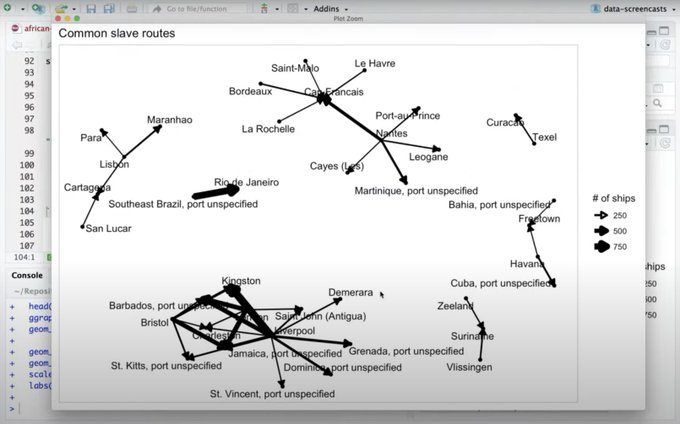
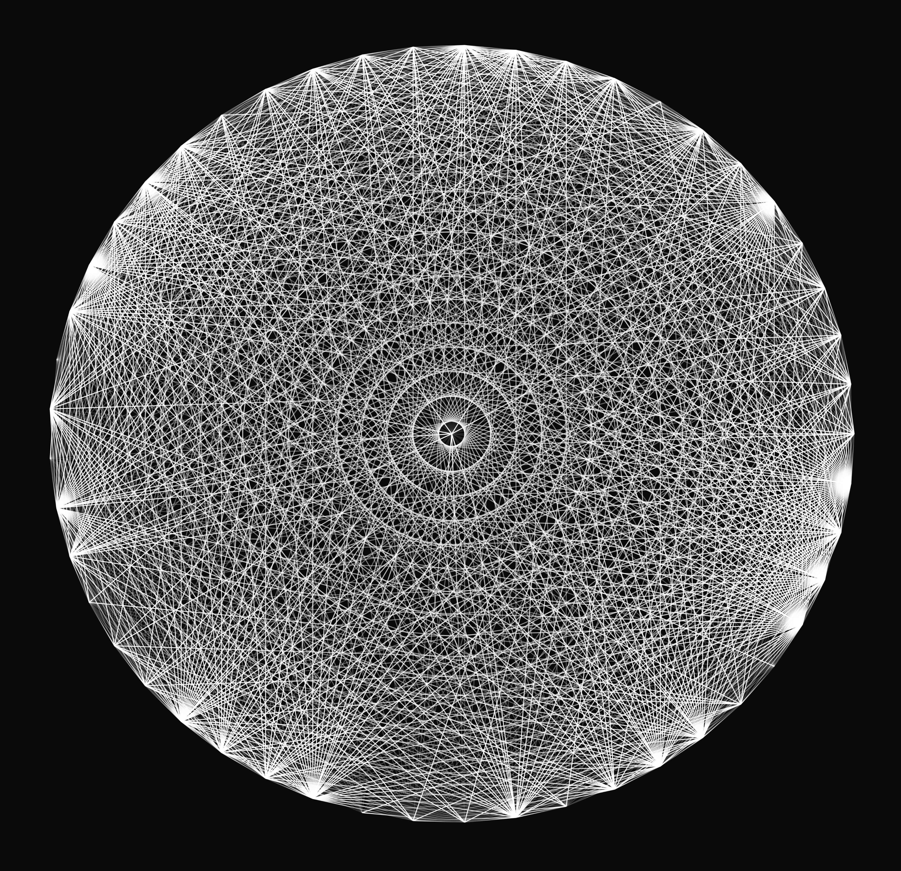
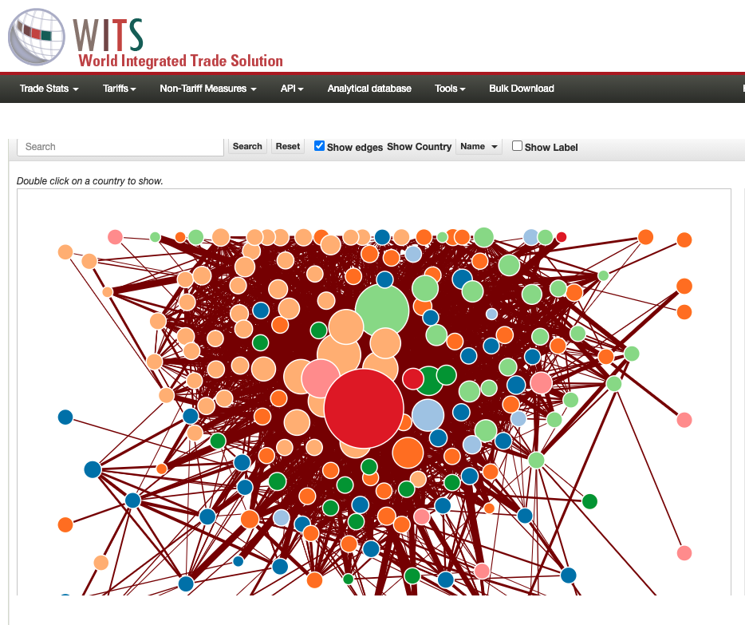
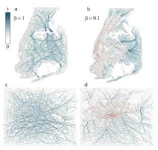
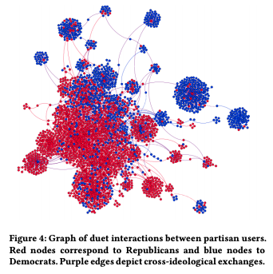

```{r xaringan-themer, include=FALSE, warning=FALSE}
library(xaringanthemer)
style_mono_accent(
  base_color = "#1c5253",
  header_font_google = google_font("Josefin Sans"),
  text_font_google   = google_font("Montserrat", "300", "300i"),
  code_font_google   = google_font("Fira Mono")
)
```

```{r setup, include=FALSE, warning=FALSE}
knitr::opts_chunk$set(cache=TRUE)
```

class: middle

# Learning Objectives

+ Examine examples of networks/graphs
+ Explain why we care about networks
+ Understand basic structure, terminologies, concepts of networks/graphs
+ Familiarize on different representations of a network

---

# What are some networks/graphs?

Let's see it from our TidyTuesday Twitter community `r emo::ji("bird")`: from informative to witty to artsy

.left-column[

Common Slave Routes: @drob
]

.right-column[

]

---

# What are some networks/graphs?
Let's see it from our TidyTuesday Twitter community `r emo::ji("bird")`: from informative to witty to artsy

.left-column[

UN Voting: @jdavison
]

.right-column[

]

---

# What are some networks/graphs?
Let's see it from our TidyTuesday Twitter community `r emo::ji("bird")`: from informative to witty to artsy

.left-column[

Simpson's guesting: @jmcastagnetto
]

.right-column[

]
---


# What are some networks/graphs?
Let's see it from our TidyTuesday Twitter community `r emo::ji("bird")`: from informative to witty to artsy

.left-column[

Cocktail ingredients: @andreaNOdell
]

.right-column[

]

---

# What are some networks/graphs?
Let's see it from our TidyTuesday Twitter community `r emo::ji("bird")`: from informative to witty to artsy

.left-column[

Art?: @cedscherer
]

.right-column[

]
---


# Why should we care?

Network analysis tries to uncover insights that are often covert when only records are analyzed as independent elements in a collection. 

It allows us to leverage the _structure_ of the collection and the _emergent properties_ that arise from the _interactions_ of the elements

## How?
+ **From Occurence to Co-occurrence**
  - "The most common item in a grocery basket is chips"
  - "Chips are most often bought with guac"
+ **From Popularity to Importance**
  - "Senator Alice and Senator Bob are the most prominent figures of Donkey and Elephant parties, respectively"
  - "If you want a bipartisan bill passed, you need Senator Charlie to co-sponsor the bill"
+ **From State to Flow**
  - "Grand Central terminal receives about 300K ridership a day"
  - "Grand Central has 200K riders coming from Manhattan, and 50K each from Brooklyn and Queens"

---

class: inverse, center, middle

# Network Concepts and Real World Examples

The aim is to familiarize ourselves with some of the key terms we might encounter `r emo::ji("+1")`
---
# Graph Components with Trade Economics

.pull-left[
A **graph**^ (or network) is a representation of how **things** are **connected**.<br/>

- **things** are called the *nodes* OR *vertex*
- **connections** are called *edges*

In this example, each **node** is a **country**, and each **edge** represents **existence of trading** between countries 


Sometimes edges have *weights* which measures 'strength' of relationship between nodes. Here, the thickness of the line represents country's share of exports
]

.pull-right[


United States perspective Total - All-Groups, for Export and Buyer 2016
https://wits.worldbank.org/CountryNetwork.aspx?lang=en
]

.footnote[
^symbolically, you might also see the notation `G(V, E)` for graphs containing vertices V and edges E `r emo::ji("smile")`
]
---
# Centrality with Transportation Studies

.pull-left[
**Centrality** is a concept that deals with how important is a **vertex** in the network

In this paper, the authors have a section that tries to identify congested locations based on the locations' betweenness centrality. 

### The variety of centrality measures includes:

- **Degree**: measure number of nodes connected to it
- **Betweenness**: aims to measure of likelihood of being a 'bridge'
- **Closeness**: aims to measure the distance of a node from all other nodes
]

.pull-right[


Multiplex networks in metropolitan areas: generic features and local effects
<br/>
https://doi.org/10.1098/rsif.2015.0651
]
---

# Clustering with Computational Soc. Science

.pull-left[
Community detection or finding **clusters** is about identifying subgroups from the whole graph. Imagine this as an analog of **k-means clustering** or **hierarchical clustering** 

Useful for 
- Analyzing fragmentation and polarization
  - "How to get away with breaking terrorist cells?"
- Understanding flow of information
  - "How I met your 'Parler?'"
- Summarization: from individual members to clusters
  - "How to train your ML with reduced dimensions?"

The visualization from this paper shows strong partisanship in the realm of TikTok duets.
]

.pull-right[


Dancing to the Partisan Beat: A First Analysis of Political Communication on TikTok
<br/>
https://doi.org/10.1145/3394231.3397916
]
---
class: inverse, center, middle

# Well, cool...but how do I get started?

Time to get our hands dirty!

---

# Walkthrough: Network Analysis in R

### Packages
```{r, echo=TRUE, warning=FALSE, message=FALSE}
# nothing is tidy without
library(tidyverse)

# manipulating graph data structure tidily 
library(tidygraph) 

# visualizing graphs (or graphing graphs :) )
library(ggraph)

# this was the OG when I was in school ~5 years ago
# tidygraph abstracts most of the APIs here 
# library(igraph) 
```

---

# Creating a graph of Twitter mentions

Note: We'll be skipping API's and `{rtweet}` since Layla covered this from last week. 

Toy Example:
> Who are the top mentionees and mentioners in the #TidyTuesday community?

> What are some of the 'cliques' in this network, and who are its members?

Steps

1. Loading raw data and data cleaning
2. Creating edgelist table 
3. Converting to graph object
4. Generating graph statistics
5. Visualizing graph

---

# Loading raw data and data cleaning

.pull-left[
We'll start of by loading the twitter dataset in `{dataedu}`
```{r, echo=TRUE, warning=FALSE, message=FALSE}
library(dataedu)
tt_tweets <- dataedu::tt_tweets
```
]

.pull-right[
Here are the variables in this table
```{r, echo=TRUE, warning=FALSE, message=FALSE}
names(tt_tweets) %>% paste(collapse=", ") %>% str_wrap(35) %>% cat()
```
]
---
# Loading raw data and data cleaning

Finding mentions
```{r, echo=TRUE, warning=FALSE, message=FALSE}
regex_pattern <- "@([A-Za-z]+[A-Za-z0-9_]+)(?![A-Za-z0-9_]*\\.)"

mentions_step1 <- tt_tweets %>%
  # Use regular expression to identify all the usernames in a tweet
  mutate(all_mentions = str_extract_all(text, regex_pattern)) %>%
  unnest(all_mentions) %>% # hey, a friend from text analysis in ch. 11!! :)
  mutate(all_mentions = str_trim(all_mentions)) %>%
  select(sender = screen_name, all_mentions)


print(utils::head(mentions_step1,2))
```
---

# Creating edgelist table

.pull-left[
`r emo::ji("bulb")` An **edgelist** representation essentially lists all edges in a graph.

Each record represents the existence of a connection between a node to another.
<hr/>
Here `mentions` is an edgelist table connecting a user A to another user B if, A mentions B. 
```{r, echo=TRUE, warning=FALSE, message=FALSE}
mentions <-
  mentions_step1 %>%
  mutate(all_mentions = str_sub(all_mentions, start = 2)) %>%  #remove `@` in the string of mentioned user
  # rename all_mentions to receiver
  select(sender, receiver = all_mentions)
```
]

.pull-right[
```{r, echo=TRUE, warning=FALSE, message=FALSE}
print(mentions)
```
]
---
class: center, middle

# `r emo::ji("bulb")` Segue Concept: (Un)Directedness
A graph can be **directed** or **undirected**. 

As the name suggest, **directed** graphs are strict in a sense that a connection from node X to Y, does not necessarily imply that a connection exist from node Y to X. Further, if connections exist from X to Y, and from Y to X, their **weights** need not be the same.

Cheeky Example: In graphs of "relationships", if feelings are **requited**, you get an **undirected** graph; Unfortunately, if they are **unrequited**, then you get a **directed** graph.

Checkpoint: is our `mentions` table directed or undirected?
---

# Converting to graph 
.pull-left[
By using `{tidygraph}`, we can convert the `mentions` dataframe into a graph.

`r emo::ji("bulb")` Notice how this is represented as an **adjacency list**. It is another represetation of a graph! 

For a given node, it lists all of the nodes that are connected to it. For example:
- @dgwinfred mentioned @CedScherer
- @davidmasp mentioned @thomasp
]

.pull-right[
```{r, echo=TRUE, warning=FALSE, message=FALSE}
g <- 
  as_tbl_graph(mentions)

str(g)
```
]
---

# Generating graph statistics with `{tidygraph}`

(Out) Degree Centrality: who are the top mentioners?

.pull-left[
```{r}
degree_stat <- g %>%
  mutate(degree=centrality_degree(mode="out")) %>% 
  # pull out the "nodes" attribute of g
  activate(nodes) %>% 
  as_tibble() %>%
  top_n(10, degree) %>%
  dplyr::arrange(desc(degree))
```
]
--
.pull-right[
```{r}
print(degree_stat)
```
]
---

# Using `{tidygraph}` APIs to get graph statistics

(In) Degree Centrality: who are the top mentionees?

.pull-left[
```{r}
degree_stat <- g %>%
  mutate(degree=centrality_degree(mode="in")) %>% 
  # pull out the "nodes" attribute of g
  activate(nodes) %>% 
  as_tibble() %>%
  top_n(10, degree) %>%
  dplyr::arrange(desc(degree))
```
]
--
.pull-right[
```{r}
print(degree_stat)
```
]
---

# Visualizing the graph
.pull-left[

Here, we use the APIs from `{ggraph}`. It takes a graph object as its input. We can then add layout (which organizes the nodes based on different algorithms). `geom_node_point` and `geom_edge_link` specifies the network features that are mapped to the aesthetics.
```{r, echo=TRUE, warning=FALSE, message=FALSE}
p <- 
  # we chose the kk layout as it created a graph which was easy-to-interpret, 
  # but others are available; see ?ggraph
  ggraph(g, layout = "kk") +
  # this adds the points to the graph
  geom_node_point() +
  # this adds the links, or the edges; 
  #alpha = .2 makes it so that the lines are partially transparent
  geom_edge_link(alpha = .2) +
  # this last line of code adds a ggplot2 
  # theme suitable for network graphs
  theme_graph()
```
]

.pull-right[
```{r, echo=TRUE, warning=FALSE, message=FALSE, out.height=300}
print(p)
```
]
---
# Visualizing the graph

Let's use the node's in-degree centrality to remove users that are not mentioned that often. Let's also visualize that by mapping the size and color aesthetic of the node to this centrality measure.

.pull-left[
```{r, echo=TRUE, warning=FALSE, message=FALSE}
p <- g %>%
  # we chose the kk layout as it created a graph which was easy-to-interpret, 
  # but others are available; see ?ggraph
  mutate(degree=centrality_degree(mode="in")) %>% 
  # pull out the "nodes" attribute of g
  activate(nodes) %>% 
  filter(degree>5) %>%
  ggraph(layout = "kk") +
  geom_edge_link(alpha = .2) +
  geom_node_point(aes(size = degree, colour = degree)) + 
  theme_graph()
```
]

.pull-right[
```{r, echo=TRUE, warning=FALSE, message=FALSE}
print(p)
```
]

---

# Bonus: finding cliques!

> We're not insinuating cliques in a "Mean Girl" way. **Cliques** has a precise meaning in graphs: a subgraph, where all the nodes are connected with each other. 

Note: clique by default turns directed graphs to undirected graphs AFAIK
```{r, warning=FALSE}
largest_clique_size <- igraph::clique_num(g)

cliques <- igraph::cliques(g, largest_clique_size)
```
---

```{r, echo=TRUE, warning=FALSE, message=FALSE, out.width = 700}
plots <- list()
for (i in 1:3) {
  clique_members <- names(cliques[[i]])
  plots[[i]] <- g %>%
    mutate(degree=centrality_degree(mode="in")) %>% 
    activate(nodes) %>% 
    mutate(is_in=name %in% clique_members) %>%
    filter(degree>3) %>%
    ggraph(layout = 'kk') +
    geom_edge_link(alpha = .1) +
    geom_node_point(aes(size = degree, colour = is_in)) + 
    # theme_graph() +
    theme(legend.position = "none") +
    labs(caption=str_wrap(paste(clique_members, collapse=" "), 30))
}
```
---
```{r, echo=TRUE, warning=FALSE, message=FALSE, out.height = 500, out.width=1000,dpi=300}
print(patchwork::wrap_plots(plots, nrow = 1))
```